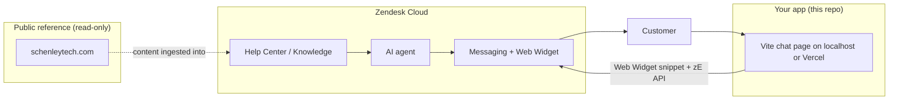

# Schenley Zendesk AI CSR Agent — Setup Guide

This project connects a **test chat UI** (Vite app in `schenley-chat-ui/`) to a **Zendesk AI agent** that answers using **Schenley** knowledge ([schenleytech.com](https://schenleytech.com/)). You do **not** need source code for the Shopify store; Zendesk holds the knowledge and handles the AI replies.

## Architecture



| Layer | Role |
|--------|------|
| [schenleytech.com](https://schenleytech.com/) | Source of truth for products, policies, and brand copy (you mirror or import into Zendesk). |
| Zendesk AI agent | Answers in Messaging using knowledge + rules your boss provides. |
| `schenley-chat-ui` | Branded one-page host; loads Zendesk Messaging so chats are real Zendesk conversations (testable, auditable, escalatable to humans). |

**Important:** The Vite page is **not** a second chatbot. It embeds **Zendesk Messaging**. The AI agent is configured in **Zendesk Admin**, not in React code.

---

## What you need before you start

### Access and licenses

| Item | Why |
|------|-----|
| Zendesk account with **Admin** access | Configure AI, Messaging, Help Center, Web Widget. |
| **Zendesk Suite** (or plan that includes **AI agents** + **Messaging**) | AI CSR on messaging requires the right SKU; confirm with your Zendesk rep or Admin → Account → Subscription. |
| Optional: **Advanced AI** add-on | Richer generative answers, more knowledge sources—depends on your contract. |
| Vercel account (free tier OK) | Deploy the test chat UI. |
| GitHub (recommended) | Connect repo to Vercel for deploys. |

### From your boss (company information)

Collect these in a shared folder (Google Drive / Notion / ticket). The AI agent quality depends on this.

1. **Brand**
   - Tone of voice (“Be Simple, Be Graceful”), words to use/avoid, escalation tone.
   - Support hours and timezone (site mentions 24H quick response—confirm SLA).

2. **Products** (align with site collections)
   - Steam mops: Hestia, Hestia Lite, Iris, Tethys.
   - Steam cleaners: Hera, Tethys.
   - Carpet: Doris, Iris.
   - Vacuum: Hygea wet/dice.
   - Accessories: pads, demineralized water, nozzles, brushes, etc.
   - For each: SKU/model, price bands, what’s in the box, compatible accessories, common issues.

3. **Policies** (must match legal pages on the site)
   - Shipping (free shipping claim), delivery regions.
   - Returns: **30-day returns** (confirm exceptions).
   - Warranty: **one year** (what’s covered, proof of purchase, RMA process).
   - Refunds, replacements, out-of-stock / preorder handling.

4. **Channels**
   - When to mention TikTok Shop, Amazon, Walmart vs schenleytech.com only.
   - Order lookup: what the bot can vs cannot do (PII rules).

5. **Escalation**
   - When AI must hand off to a human (billing disputes, injury, legal, angry customer, missing order after X days).
   - Target group(s) in Zendesk for live agents.

6. **FAQs**
   - Top 50 real tickets or support macros.
   - Product care (demineralized water, pad washing, floor types safe for steam).

7. **Optional but valuable**
   - PDF manuals, warranty cards, internal troubleshooting trees.
   - Approved macros / saved replies from current support team.

### Technical values you will copy into the chat UI

| Value | Where to get it |
|--------|------------------|
| **Web Widget key** (Messaging) | Admin Center → **Channels** → **Messaging and social** → **Messaging** → **Installation** → Web Widget snippet (`key=...`). |
| Zendesk subdomain | e.g. `yourbrand.zendesk.com` (for Help Center URLs and testing). |

Put the widget key in `schenley-chat-ui/.env`:

```env
VITE_ZENDESK_WIDGET_KEY=your_key_here
```

On Vercel: Project → Settings → Environment Variables → same name.

---

## Step-by-step: Zendesk AI CSR

### Phase 1 — Foundation (Day 1)

1. **Create or use existing Zendesk account** for Schenley / Brandlink.
2. **Enable Messaging**
   - Admin Center → Channels → Messaging and social → Messaging.
   - Turn on the **Web Widget** channel for your test site URL (localhost + Vercel domain).
3. **Help Center**
   - Enable Help Center if not already.
   - Create structure: Products, Orders & Shipping, Returns & Warranty, Troubleshooting, Contact.

### Phase 2 — Knowledge from schenleytech.com (Day 2–4)

You do not have the Shopify theme repo; ingest **content**, not code.

**Option A — Manual (safest, best for launch)**  
For each public page/policy, create a Help Center article. Paste approved text from the boss, not unchecked auto-scrape for legal pages.

**Option B — Bulk import**  
Export site content (or use Zendesk import / third-party KB migration) into articles. Review before publishing.

**Option C — Generative knowledge (plan-dependent)**  
In Admin Center → **AI** → **AI agents** → knowledge sources, add Help Center (required) and any allowed **external** sources your plan supports. Still review answers in testing.

**Minimum articles to mirror the live site:**

- Product overviews (Hestia, Iris, Hera, Doris, Tethys, Hygea, accessories).
- Shipping & delivery.
- Returns & 30-day policy.
- One-year warranty.
- Payment methods / order status (what you can tell without logging into Shopify).
- Contact / escalation to human.

Publish articles in the same locale(s) you support (English first; site also lists Español, Français).

### Phase 3 — Configure the AI agent (Day 4–5)

Exact menus change with Zendesk versions; use Admin Center search for **“AI agents”**.

1. **Create or edit the default AI agent** for Messaging.
2. **Connect knowledge**
   - Help Center articles (all customer-facing sections).
   - Internal articles only if the agent should use them (usually **no** for CSR).
3. **Persona / instructions** (use boss-provided copy), e.g.:
   - You are Schenley customer support for cleaning appliances.
   - Be concise, friendly, practical; match “Be Simple, Be Graceful.”
   - Only state product facts present in knowledge; if unsure, offer human handoff.
   - Never invent order numbers or refund approvals.
4. **Channels**
   - Attach agent to **Messaging** / Web Widget.
5. **Handoff**
   - Enable transfer to human agents when confidence is low or customer asks.
   - Map to the correct support group and business hours.

### Phase 4 — Web Widget for your test site (Day 5)

1. Admin Center → Messaging → **Installation**.
2. Copy the snippet; extract the `key` parameter for `.env`.
3. **Allowed domains**: add `http://localhost:5173` and your `*.vercel.app` URL (and production domain later).
4. Optional: Admin → Messaging → **Style** and **Launcher** to match Schenley branding (or hide launcher and use this repo’s custom button—see `schenley-chat-ui`).

Reference: [Zendesk Messaging Web Widget API](https://developer.zendesk.com/documentation/zendesk-web-widget-sdks/sdks/web/sdk_api_reference/).

### Phase 5 — Test (Day 6)

1. Run chat UI locally (`schenley-chat-ui/README.md`).
2. Ask questions a real customer would ask:
   - “Is Iris safe on hardwood?”
   - “How do I return Hestia within 30 days?”
   - “Where can I buy replacement microfiber pads?”
3. In Zendesk, open **AI agent** / conversation logs; fix wrong articles or instructions.
4. Test **human escalation** path.

### Phase 6 — Deploy UI to Vercel (Day 6)

1. Push repo to GitHub.
2. Vercel → Import project → root directory: `schenley-chat-ui`.
3. Set `VITE_ZENDESK_WIDGET_KEY`.
4. Redeploy; add Vercel URL to Zendesk allowed domains.
5. Share URL with boss for UAT.

---

## What is *not* in this repo

| Topic | Notes |
|--------|--------|
| Shopify / schenleytech.com code | Not required for CSR AI; knowledge lives in Zendesk. |
| Custom LLM in React | Avoid duplicating AI in the frontend; use Zendesk for compliance and agent tools. |
| Order lookup in chat | Needs Shopify (or OMS) integration via Zendesk apps or Sunshine Conversations APIs—phase 2 project. |

---

## Suggested folder layout in this workspace

```
zendesk ai agent/
├── ZENDESK-AI-CSR-SETUP.md    ← this guide
├── knowledge/                  ← optional: drafts for Help Center (markdown)
└── schenley-chat-ui/           ← Vite chat host for Zendesk Messaging
```

---

## Checklist (printable)

- [ ] Zendesk plan includes AI agents + Messaging  
- [ ] Admin access  
- [ ] Boss packet: products, policies, FAQs, escalation rules  
- [ ] Help Center articles published  
- [ ] AI agent linked to knowledge + Messaging  
- [ ] Web Widget key in `.env` and Vercel  
- [ ] Allowed domains: localhost + Vercel  
- [ ] Test conversations + human handoff verified  
- [ ] UAT on deployed Vercel URL  

---

## Support links

- Schenley public site: [https://schenleytech.com/](https://schenleytech.com/)
- Zendesk Web Widget (Messaging) docs: [developer.zendesk.com](https://developer.zendesk.com/documentation/zendesk-web-widget-sdks/sdks/web/sdk_api_reference/)
- Zendesk Support: [support.zendesk.com](https://support.zendesk.com/)
